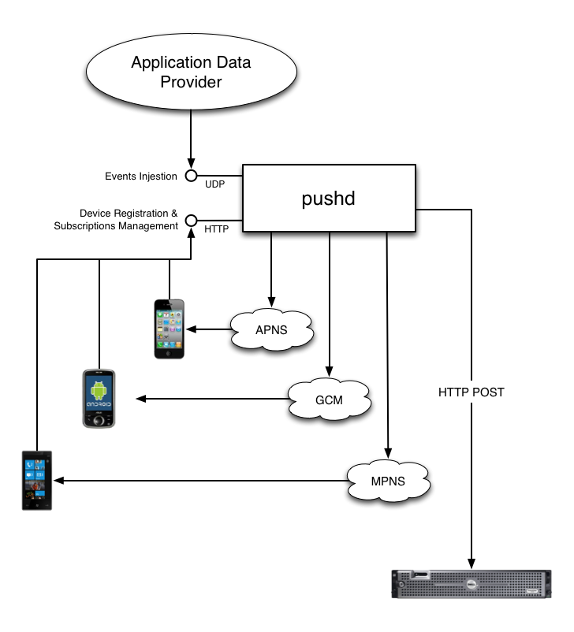

Universal Mobile Push Daemon
============================

*Pushd* is a pluggable unified push server for server-side notification to mobile native apps, web apps etc. With pushd you can send push notifications to any supported mobile platform, web app or HTTP server from a single entry point. Pushd takes care of which device is subscribed to which event and is designed to support an unlimited amount of subscribable events.



Features
--------

- Multi protocols [APNs] \(iOS), C2DM/[GCM] \(Android), [MPNS] \(Windows Phone), [HTTP] POST, [EventSource](#event-source), [WNS] \(Windows Notification Service)
- Pluggable protocols
- Register unlimited number of subscribers (device)
- Subscribe to unlimited number of events
- Automatic badge increment for iOS
- Silent subscription mode (no alert message, only data or badge increment)
- Server side message translation
- Message template
- Broadcast
- Direct messages
- GCM multicast messaging
- Events statistics
- Automatic failing subscriber unregistration
- Built-in Apple Feedback API handling
- Redis backend
- Fracking fast!

[APNs]: doc/APNs.md
[GCM]: doc/GCM.md
[MPNS]: doc/MPNS.md
[HTTP]: doc/HTTP.md
[WNS]: doc/WNS.md

Installation
------------

- Install [redis](http://redis.io/), [node.js](http://nodejs.org/), [npm](http://npmjs.org/) and [coffeescript](http://coffeescript.org/).
- Clone the repository: `git clone git://github.com/rs/pushd.git && cd pushd`
- Install dependancies: `npm install`
- Configure the server: `cp settings-sample.coffee settings.coffee && vi settings.coffee`
- Start redis: `redis-server`
- Start the server: `sudo coffee pushd.coffee`

Glossary
--------

- `Application Data Provider`: The service emitting `Events` (i.e: other users actions) to be notified to `Subscribers` (i.e.: mobiles app)
- `Subscribers`: Entities wanting to be notified about certain type of `Events`. There's two kind of subscribers: offline subscribers and online subscribers. The current implementation of pushd does only support offline subscribers. Difference between online and offline subscribers is that online subscribers are required to stay connected to maintain subscriptions while offline subscribers are persisted in pushd database, and only have to instruct pushd when they change their status (subscriptions etc.).
- `Event`: A string with associated metadata representing an action performed on the `Application Data Provider`. Events are emitted by the `Application Data Provider` (i.e.: a web site or your application's server-side backend), and `Subscribers` can subscribe to them in order to be notified by the `Protocol` of their choice.
- `Protocol`: A communication standard to send notification back to the `Subscriber`. Protocols are pluggable in pushd so you can add your own custom protocol. By default, pushd is bundled with support for APNs (iOS), C2DM/GCM (Android) and MPNS (Windows Phone). More protocols will be added in the future.

Getting Started
---------------

### Register

At first launch, your app must register with the push notification service to get a registration id. It then provides this registration id to pushd in exchange for a subscriber id (This subscriber id will be used with all further communications with pushd). Some informations can be sent with the request to pushd like: subscriber language, version or current badge value.

Subscriber registration is performed through a HTTP REST API (see later for more details). Here is an example of a subscriber registration simulated using the curl command. As an example, we will register the iOS device with the registration id `FE66489F304DC75B8D6E8200DFF8A456E8DAEACEC428B427E9518741C92C6660`. For iOS, we have to specify the `apns` protocol. We also set the subscriber language to `fr` for French and init the badge to `0`. We suppose the command is run on the same machine as pushd:

    $ curl -d proto=apns \
           -d token=FE66489F304DC75B8D6E8200DFF8A456E8DAEACEC428B427E9518741C92C6660 \
           -d lang=fr \
           -d badge=0 \
           -d category=show \
           -d contentAvailable=true \
           http://localhost/subscribers

In reply, we get the following JSON structure:

    {
        "proto":"apns",
        "token":"fe66489f304dc75b8d6e8200dff8a456e8daeacec428b427e9518741c92c6660",
        "lang":"fr",
        "badge":0,
        "updated":1332953375,
        "created":1332953375,
        "id":"J8lHY4X1XkU"
    }

Your app must save the `id` field value, it will be used for all further communication with pushd.

Note: If you perform a registration using an already registered token, the server will respond with the same subscriber id and will just update the transmitted informations. You may choose to always register the given token instead of calling the ping endpoint.

### Ping

Once the app is registered, it has to ping the pushd server each time the app is launched to let pushd know the subscriber still exists. The subscriber may have been unregistered automatically in case of repeated errors for instance. To ping pushd, you perform a POST on the `/subscriber/SUBSCRIBER_ID` url as follow:

    $ curl -d lang=fr -d badge=0 http://localhost/subscriber/J8lHY4X1XkU

On iOS, you must update the badge value to inform pushd the user read the pending notifications. You may call this URL several times, each time the badge is updated, so the next notification will still increment the badge with the correct value.

### Subscriptions

Depending on your service, your app may auto-subscribe the subscriber to some events or ask the user which events he wants to be subscribed to (an event is identified as an arbitrary string meaningful for your service). For each event your app wants to be subscribed to, a call to the pushd API must be performed.

For instance, if your app is news related, you may want to create one subscriptable event for each news category. So if your user wants to subscribe to `sport` events, the following call to pushd has to be performed:

    $ curl -X POST http://localhost/subscriber/J8lHY4X1XkU/subscriptions/sport

You may later unsubscribe by switching from the `POST` to the `DELETE` method.

You may also prefer to set all subscriptions at once by using the bulk subscription endpoint:

    $ curl -H 'Content-Type: application/json' -d '{"sport":{}, "music":{}}' http://localhost/subscriber/J8lHY4X1XkU/subscriptions

We recommend to auto-subscribe your users to some global event like for instance a country event if your app is international. This will let you send targeted messages to all of a given country’s users.

### Typical App Launch Tasks

1. Obtain device token from the OS
2. Post the token on `/subscriber/:token` with parameters like `lang`, `badge` and `version`
3. Extract the `id` from the response (you don't need to store it, treat it like a session id)
4. Resubscribe the device to all its previously subscribed events by posting on `/subscriber/:id/subscriptions`

This workflow ensures device stay registered and subscriptions are always up-to-date.

### Event Ingestion

Once subscribers are registered, your service may start to send events. Events are composed of a message, optionally translated in several languages and some additional data to be passed to your application. To send an event, you may either use the HTTP REST API or send UDP datagrams.

You don't need to create events before sending them. If nobody is subscribed to a given event, it will be simply ignored. It's thus recommended to send all the possible types of events and let your application choose which to subscribe to.

Here we will send a message to all subscribers subscribed to the `sport` event:

    $ curl -d msg=Test%20message http://localhost/event/sport

Event Source
------------

Pushd supports the [Event Source](http://www.w3.org/TR/eventsource/) protocol, also known as Server Sent Events. This allows your web application to benefits from the same pushed event than your native apps.

This protocol is very different from other pushd supported protocol because it doesn't involve subscriber registration nor stored subscriptions. The web service connects to the pushd server and declars which event it is interested in, and then pushd will push subscribed events in this same connections until the client stays connected.

You may want to use [Yaffle EventSource polyfill](https://github.com/Yaffle/EventSource) on the client side in order to support CORS requests with older browsers (see code example bellow).

When Event Source is enabled, a new `/subscribe` API endpoint is available. Use the `events` query-string parameter with a list of events separated by spaces:

    > GET /subscribe?events=event1+event2+event3 HTTP/1.1
    > Accept: text/event-stream
    >
    ---
    < HTTP/1.1 200 OK
    < Content-Type: text/event-stream
    < Cache-Control: no-cache
    < Access-Control-Allow-Origin: *
    < Connection: close
    <
    ... some time passes ...
    < data: {"event": "event1", "title": {"default": "Title", "fr": "Titre"}, "message": {...}, "data": {"var1": "val1", "var2": "val2"}}
    ... some time passes ...
    < data: {"event": "event2", "title": {"default": "Title", "fr": "Titre"}, "message": {...}, "data": {"var1": "val1", "var2": "val2"}}

Or in Javascript:

``` html
<script src="https://raw.github.com/Yaffle/EventSource/master/eventsource.js"></script>
<script>
var es = new EventSource('http://localhost/subscribe?events=event1+event2+event3');
es.addEventListener('message', function (e)
{
    var event = JSON.parse(e.data);
    document.body.appendChild(document.createTextNode(event.message.default));
    document.body.appendChild(document.createElement('br'));
});
</script>
```

See codepen example: http://codepen.io/rs/pen/xAjpy

API
---

### Subscriber Registration

#### Register a subscriber ID

Register a subscriber by POSTing on `/subscribers` with some subscriber information like registration id, protocol, language, OS version (useful for Windows Phone OS) or initial badge number (only relevant for iOS, see bellow).

    > POST /subscribers HTTP/1.1
    > Content-Type: application/x-www-form-urlencoded
    >
    > proto=apns&
    > token=FE66489F304DC75B8D6E8200DFF8A456E8DAEACEC428B427E9518741C92C6660&
    > lang=fr&
    > badge=0
    >
    ---
    < HTTP/1.1 201 Created
    < Location: /subscriber/JYJ1ehuEHbU
    < Content-Type: application/json
    <
    < {
    <   "created":1332638892,
    <   "updated":1332638892,
    <   "proto":"apns",
    <   "token":"FE66489F304DC75B8D6E8200DFF8A456E8DAEACEC428B427E9518741C92C6660",
    <   "lang":"fr",
    <   "badge":10
    < }

*Carriage returns are added for readability*

##### Mandatory parameters:

- `proto`: The protocol to be used for the subscriber. Use one of the following values:
	- `apns`: iOS (Apple Push Notification service)
	- `gcm` or `c2dm`: Android (Cloud to subscriber Messaging)
	- `mpns` Window Phone (Microsoft Push Notification Service)
- `token`: The device registration id delivered by the platform's push notification service

##### Allowed parameters:

- `lang`: The language code for the of the subscriber. This parameter is used to determine which message translation to use when pushing text notifications. You may use the 2 chars ISO code or a complete locale code (i.e.: en_CA) or any value you want as long as you provide the same values in your events. See below for info about events formatting.
- `badge`: The current app badge value. This parameter is only applicable to iOS for which badge counters must be maintained server side. On iOS, when a user read or loads more unread items, you must inform the server of the badge's new value. This badge value will be incremented automatically by pushd each time a new notification is sent to the subscriber.
- `category`: The category for the push notification action. This parameter is only applicable to iOS8. 
- `contentAvailable`: The 'content-available' flag value. This parameter is only applicable to iOS7 and applications which support Silent Remote Notifications or Newsstand capability. With iOS7 it is possible to have the application wake up before the user opens the app.
- `version`: This is the OS subscriber version. This parameter is only needed by Windows Phone OS. By setting this value to 7.5 or greater an `mpns` subscriber ids will enable new MPNS push features.

##### Return Codes

- `200` subscriber previously registered
- `201` subscriber successfully registered
- `400` Invalid specified registration id or protocol

#### Update subscriber Registration Info

On each app launch, it is highly recommended to update your subscriber information in order to inform pushd your subscriber is still alive and registered for notifications. Do not forget to check if the app notifications hasn't been disabled since the last launch, and call `DELETE` if so. If this request returns a 404 error, it means your subscriber registration has been cancelled by pushd. You must then delete the previously obtained subscriber id and restart the registration process for this subscriber. Registration can be cancelled after pushd error count for the subscriber reached a predefined threshold or if the target platform push service informed pushd about an inactive subscriber (i.e. Apple Feedback Service).

    > POST /subscriber/SUBSCRIBER_ID HTTP/1.1
    > Content-Type: application/x-www-form-urlencoded
    >
    > lang=fr&badge=0
    >
    ---
    < HTTP/1.1 204 No Content

##### Allowed parameters:

- `lang`: The language code for the of the subscriber. This parameter is used to determine which message translation to use when pushing text notifications. You may use the 2 chars ISO code or a complete locale code (i.e.: en_CA) or any value you want as long as you provide the same values in your events. See below for info about events formatting.
- `badge`: The current app badge value. This parameter is only applicable to iOS for which badge counters must be maintained server side. On iOS, when a user read or loads more unread items, you must inform the server of the badge's new value. This badge value will be incremented automatically by pushd each time a new notification is sent to the subscriber.
- `version`: This is the OS subscriber version. This parameter is only needed by Windows Phone OS. By setting this value to 7.5 or greater an `mpns` subscriber ids will enable new MPNS push features.

NOTE: this method should be called each time the app is opened to inform pushd the subscriber is still alive. If you don’t, the subscriber may be automatically unregistered in case of repeated push error.

##### Return Codes

- `204` subscriber info edited successfully
- `400` Format of the subscriber id or a field value is invalid
- `404` The specified subscriber does not exist

#### Unregister a subscriber ID

When the user chooses to disable notifications from within your app, you can delete the subscriber from pushd so pushd won't send further push notifications.

    > DELETE /subscriber/SUBSCRIBER_ID HTTP/1.1
    >
    ---
    < HTTP/1.1 204 No Content

##### Return Codes

- `204` subscriber unregistered successfully
- `400` Invalid subscriber id format
- `404` The specified subscriber does not exist

#### Get information about a subscriber ID

You may want to read informations stored about a subscriber id.

    > GET /subscriber/SUBSCRIBER_ID HTTP/1.1
    >
    ---
    < HTTP/1.1 200 Ok
    < Content-Type: application/json
    <
    < {
    <   "created":1332638892,
    <   "updated":1332638892,
    <   "proto":"apns",
    <   "token":"FE66489F304DC75B8D6E8200DFF8A456E8DAEACEC428B427E9518741C92C6660",
    <   "lang":"fr",
    <   "badge":10
    < }

*Carriage returns are added for readability*

##### Return Codes
- `200` subscriber exists, information returned
- `400` Invalid subscriber id format
- `404` The specified subscriber does not exist

#### Self Subscriber Test

You may want to test from your app if the push notification system is working. You can test this by POSTing an empty body on `/subscriber/SUBSCRIBER_ID/test`. Pushd will send back a test notification with "Test" as message and {"test": "ok"} as data.

    > POST /subscriber/SUBSCRIBER_ID/test HTTP/1.1
    >
    --
    < HTTP/1.1 201 Created

##### Return Codes
- `200` subscriber exists, information returned
- `400` Invalid subscriber id format
- `404` The specified subscriber does not exist

#### Subscribe to an Event

For pushd, an event is represented as a simple string. By default a subscriber won't receive push notifications other than broadcasts or direct messages if it’s not subscribed to events. Events are text and/or data sent by your service on pushd. Pushd's role is to convert this event into a push notification for any subscribed subscriber.

You subscribe a previously registered subscriber by POSTing on `/subscriber/SUBSCRIBER_ID/subscriptions/EVENT_NAME` where `EVENT_NAME` is a unique string code for the event. You may post an option parameter to configure the subscription.

	> POST /subscriber/SUBSCRIBER_ID/subscriptions/EVENT_NAME HTTP/1.1
	> Content-Type: application/x-www-form-urlencoded
    >
	> ignore_message=1
    >
    ---
	< HTTP/1.1 204 No Content

##### Allowed Parameter

- `ignore_message`: Defaults to 0, if set to 1, the message part of the subscribed event won't be sent with the notification. On iOS, the badge will still be incremented and updated. You can use this to update the badge counter on iOS without disturbing the user if he didn't want to be explicitly notified for this event but still wants to know how many new items are available. On Android you may use this kind of subscription to notify your application about new items available so it can perform background pre-fetching without user notification.

##### Return Codes

- `201` Subscription successfully created
- `204` Subscription successfully updated
- `400` Invalid subscriber id event name format
- `404` The specified subscriber does not exist

#### Unsubscribe from an Event

To unsubscribe from an event, perform a DELETE on the subscription URL.

	> DELETE /subscriber/SUBSCRIBER_ID/subscriptions/EVENT_NAME HTTP/1.1
    >
    ---
	< HTTP/1.1 204 No Content

##### Return Codes

- `204` Subscription deleted
- `400` Invalid subscriber id or event name format
- `404` The specified subscriber does not exist

#### List subscribers’ Subscriptions

To get the list of events a subscriber is subscribed to, perform a GET on `/subscriber/SUBSCRIBER_ID/subscriptions`.

    > GET /subscriber/SUBSCRIBER_ID/subscriptions HTTP/1.1
    >
    ---
    < HTTP/1.1 200 Ok
    < Content-Type: application/json
    <
    < {
    <   "EVENT_NAME": {"ignore_message": false},
    <   "EVENT_NAME2": ...
    < }

To test for the presence of a single subscription, perform a GET on the subscription URL

    > GET /subscriber/SUBSCRIBER_ID/subscriptions/EVENT_NAME HTTP/1.1
    >
    ---
    < HTTP/1.1 200 Ok
    < Content-Type: application/json
    <
    < {"ignore_message":false}

#### Bulk edit subscribers's Subscriptions

To set all subscriptions in one request, perform a POST with a JSON object on `/subscriber/SUBSCRIBER_ID/subscriptions` with event names as key and a dictionary of options as value or null.

    > POST /subscriber/SUBSCRIBER_ID/subscriptions HTTP/1.1
    > Content-Type: application/json
    >
    > {
    >   "EVENT_NAME": {"ignore_message": false},
    >   "EVENT_NAME2": ...
    > }
    ---
    < HTTP/1.1 200 Ok

### Event Ingestion

To generate notifications, your service must send events to pushd. The service doesn't have to know if a subscriber is subscribed to an event in order to send it, it just sends all subscriptable events as they happen and pushd handles the rest.

It is also possible to ignore subscriptions and generate notifications directly using specialized event names.

An event is some key/value pairs in a specific format sent to pushd either using HTTP POST or UDP datagrams.

#### Event names

The event name is commonly used to send notifications for registered subscriptions. There are two exceptions, in which case notifications can be sent without a subscription:

- `broadcast` sends the notification to all subscribers
- `unicast:SUBSCRIBER_ID` sends the notification to the subscriber with the specified id


#### Event Message Format

An event message is a dictionary of optional key/values:

- `title`, `msg`: The event title/message. If no title nor message are provided, the event will only send data to the app and won't notify the user. The `title` is only relevant for Android and Windows Phone, iOS doesn't support this value: the application name is always used as notification title. *The value can contain placeholders to other keys, see Message Template bellow.*
- `title.<lang>`, `msg.<lang>`: The translated version of the event title/message. The `<lang>` part must match the `lang` property of a target subscriber. If subscribers use full locale (i.e. `fr_CA`), and no matching locale value is provided, pushd will fallback to a language only version of the value if any (i.e. `fr`). If no translation matches, the `title` or `msg` key is used. *The value can contain placeholders to other keys, see Message Template bellow.*
- `data.<key>`: Key/values to be attached to the notification
- `var.<key>`: Stores strings to be reused in `msg` and `<lang>.msg` contents
- `sound`: The name of a sound file to be played. It must match a sound file name contained in you bundle app. (iOS only)

#### Event Message Template

The `msg` and `<lang>.msg` keys may contain references to others keys in the event object. You may refer either to `data.<key>` or `var.<key>`. Use the `${<key name>}` syntax to refer to those keys (ex: `${var.title}`).

Here is an example of an event message using translations and templating (spaces and carriage returns have been added for readability):

    msg=${var.name} sent a new video: ${var.title}
    msg.fr=${var.name} a envoyé une nouvelle video: ${var.title}
    sound=newVideo.mp3
    data.user_id=fkwhpd
    data.video_id=1k3dxk
    var.name=John Doe
    var.title=Super awesome video

#### Event API

##### HTTP

To send an event to pushd over HTTP, POST some urlencoded key/value pairs to the `/event/EVENT_NAME` endpoint of the pushd server:

    > POST /event/user.newVideo:fkwhpd HTTP/1.1
    > Content-Type: application/x-www-form-urlencoded
    >
    > msg=${var.name} sent a new video: ${var.title}&
    > msg.fr=${var.name} a envoyé une nouvelle video: ${var.title}&
    > sound=newVideo.mp3&
    > data.user_id=fkwhpd&
    > data.video_id=1k3dxk&
    > var.name=Jone Doe&
    > var.title=Super awesome video
    ---
    < HTTP/1.1 204 Ok

*Carriage returns are added for readability*

The server will answer OK immediately. This doesn't mean the event has already been delivered.

##### UDP

The UDP event posting API consists of a UDP datagram targeted at the UDP port 80 containing the URI of the event followed by the message content as query-string compressed using gzip:

    GZIP(POST /event/user.newVideo:fkwhpd?msg=%24%7Bvar.name%7D+sent+a+new+video%3A+%24%7Bvar.title%7D&msg.fr=%24%7Bvar…)

Here is a simple PHP example to post an UDP event:

    $pushdHost = '1.2.3.4';
    $pushdPort = 80;
    $eventName = 'user.newVideo:fkwhpd';
    $payload = array
    (
        'msg' => '${var.name} sent a new video: ${var.title}',
        'msg.fr' => '${var.name} a envoyé une nouvelle video: ${var.title}',
        'sound' => 'newVideo.mp3',
        'data.user_id' => 'fkwhpd',
        'data.video_id' => '1k3dxk',
        'var.name' => 'Jone Doe',
        'var.title' => Super awesome video'
    );
    $msg = gzcompress('POST /event/' . urldecode($eventName) . '?' . http_build_query($payload));
    $socket = socket_create(AF_INET, SOCK_DGRAM, SOL_UDP);
    socket_sendto($socket, $msg, strlen($msg), 0, $pushdHost, $pushdPort);
    socket_close($socket);

#### Event Statistics

When an event get at least one subscriber, pushd start to account some statistics on the event. Those stats persists until the event keep at least one subscriber. Those statistics can be used for monitoring or to present stats about the event to the user like approx number of notification per day for this event.

To get statistics from an event, perform a GET on `/event/EVENT_NAME`:

    > GET /event/EVENT_NAME HTTP/1.1
    >
    ---
    < HTTP/1.1 200 Ok
    < Content-Type: application/json
    <
    < {
    <   "created": 1334097188,
    <   "total": 154
    < }

##### Return Codes

- `200` Statistics returned
- `404` The specified event does not exist

#### Event Purge

When the application data provider know about a particular event will no longer be available, it can force pushd to forget about it and unsubscribe all current subscribers from it. To purge an event, perform a DELETE on `/event/EVENT_NAME`

    > DELETE /event/EVENT_NAME HTTP/1.1
    >
    ---
    < HTTP/1.1 204 Ok
    <

The DELETE method is also available thrus UDP.

##### Return Codes

- `204` Event deleted
- `404` The specified event does not exist

### Monitoring

#### Check service status

Ensures that the service is running and connected to Redis.

    > GET /status HTTP/1.1
    >
    ---
    < HTTP/1.1 204 No Content 

##### Return Codes

- `204` Server running and connected to Redis
- `503` Server running but not connected to Redis


Logging
-------

The verbosity of logging can be configured with the `loglevel` property in settings.coffee.

    exports['loglevel'] = 'verbose'

Possible levels:

- `error`: log errors only
- `warn`: log also warnings
- `info`: log status messages
- `verbose`: log event and subscriber creation and deletion
- `silly`: log submitted message content

Testing
-------

### Unit tests

`npm test`

### Performance testing

See [tests/performance/README.md](tests/performance/README.md).

License
-------

(The MIT License)

Copyright (c) 2011 Olivier Poitrey <rs@dailymotion.com>

Permission is hereby granted, free of charge, to any person obtaining a copy of this software and associated documentation files (the 'Software'), to deal in the Software without restriction, including without limitation the rights to use, copy, modify, merge, publish, distribute, sublicense, and/or sell copies of the Software, and to permit persons to whom the Software is furnished to do so, subject to the following conditions:

The above copyright notice and this permission notice shall be included in all copies or substantial portions of the Software.

THE SOFTWARE IS PROVIDED 'AS IS', WITHOUT WARRANTY OF ANY KIND, EXPRESS OR IMPLIED, INCLUDING BUT NOT LIMITED TO THE WARRANTIES OF MERCHANTABILITY, FITNESS FOR A PARTICULAR PURPOSE AND NONINFRINGEMENT. IN NO EVENT SHALL THE AUTHORS OR COPYRIGHT HOLDERS BE LIABLE FOR ANY CLAIM, DAMAGES OR OTHER LIABILITY, WHETHER IN AN ACTION OF CONTRACT, TORT OR OTHERWISE, ARISING FROM, OUT OF OR IN CONNECTION WITH THE SOFTWARE OR THE USE OR OTHER DEALINGS IN THE SOFTWARE.
